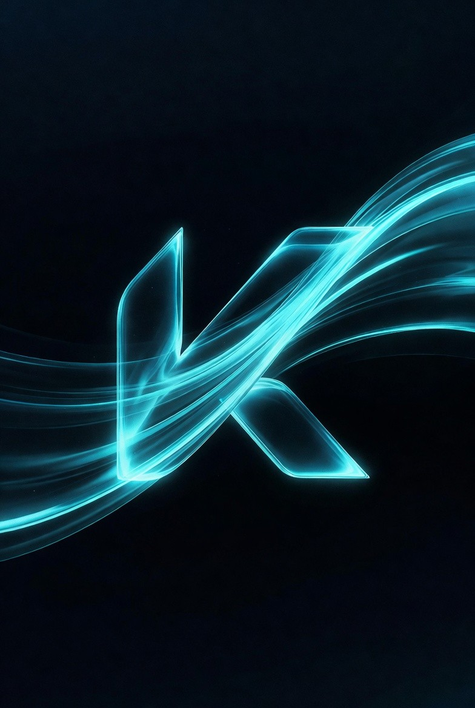
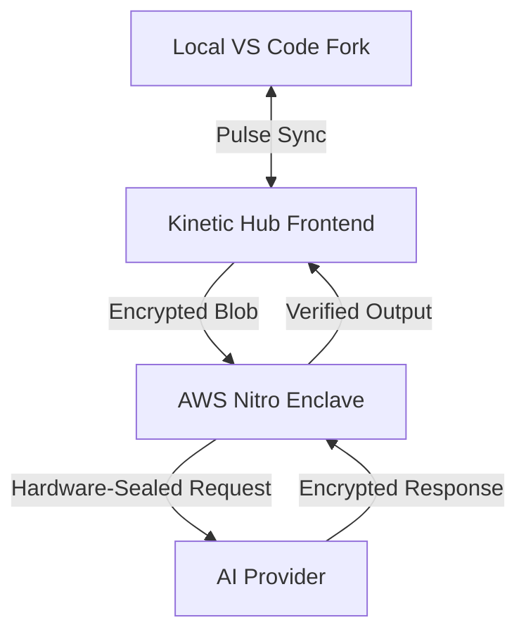

  
  <h1>Kinetic IDE — Frontend Interface</h1>
  
<strong>Intelligence Without Surveillance</strong>

  
  
  
  

  <h4>This repository serves as the public representative and brand asset hub for the Kinetic IDE Frontend Interface.</h4>

---

## ⚡ The Mission: Intelligence Without Surveillance

Kinetic IDE was founded on a singular belief: **Privacy is a hardware requirement, not a software promise.** While most AI tools trade sovereignty for speed, Kinetic refuses to compromise. 

This repository documents the frontend architecture and evolution of the [Kinetic IDE Website](https://kinetic-ide.com), the high-fidelity gateway to the world's first hardware-sealed AI developer experience.

---

## 🏗️ Evolution: V1.0.0 → V1.5.0

Today marks the release of **V1.5.0**, a major modernization milestone that aligns the frontend interface with the high-fidelity nature of the Kinetic IDE core.

| Feature | V1.0.0 (The Foundation) | V1.5.0 (The Modernization) |
| :--- | :--- | :--- |
| **Framework** | Next.js 14 | **Next.js 15.5.15 (Async Native)** |
| **UI Fidelity** | Standard Components | **High-Fidelity Glassmorphism** |
| **Motion** | basic-css transitions | **Framer Motion + 3D Magnetic Interaction** |
| **Security** | Standard HTTPS | **Nitro Enclave Encrypted Routing** |
| **Performance** | CSR-heavy | **Optimized SSR + Suspense Boundaries** |

---

## 🛠️ Tech Stack & Architecture

The Kinetic Frontend is engineered for maximum performance and absolute data sovereignty. It acts as the primary interface for the development community and enterprise partners.

### **High-Fidelity 3D Baseline**
The V1.5.0 release introduces a standard for **3D Interaction Fidelity**, powered by the `KineticLogo3D` interactive engine:
- **Magnetic Tilt Interface**: Real-time cursor-tracking physics for brand signatures.
- **Vertex Energy Flows**: Dynamic shader-based atmospheric effects.
- **Atmospheric Depth**: Multi-layered glassmorphic compositions with high-performance bloom.

---

## 🔬 Technical Deep Dive: The 3D Engine

To showcase the engineering quality behind the Kinetic interface, we have included the source code for our signature 3D brand interaction.

- **[KineticLogo3D.tsx](highlights/KineticLogo3D.tsx)**: Explore the Three.js and GSAP logic driving the magnetic "K" logo, vertex energy rings, and interactive smoothing.

---

### **Core Stack**
- **Next.js 15**: Leveraging the latest App Router and asynchronous request handling.
- **Framer Motion**: Powering the atmospheric "Energy Flow" and interactive 3D logos.
- **Rust Integration**: The frontend acts as a high-fidelity dashboard for the underlying **Kinetic Rust Engine**.
- **AWS Nitro Enclaves**: Hardware-sealed routing for all sensitive AI request metadata.

### **System Data Flow**

---

## 👥 Meet the Founders

Kinetic Tech Solution LLC was born from a desire to build the tool we wish existed.

- **Liaqat Ali**: Co-Founder & Vision Lead
- **M. Abbas Baber**: Co-Founder & Engineering Lead

> "We grow the core. You grow the AI. Kinetic is built to be the IDE you install on day one and never replace."

---

## 📂 Public Asset Hub

We believe in professional transparency. While the source code remains proprietary, we provide our brand assets and technical highlights for community and press use:

- **/public/logo**: High-resolution 3D logos and brand guidelines.
- **/public/animations**: Cinematic Lottie and MP4 animations driving the high-fidelity UI.
- **/highlights**: Source code for key frontend technical achievements (e.g., [KineticLogo3D.tsx](highlights/KineticLogo3D.tsx)).

---

## 🛡️ License & Copyright

All frontend code, design primitives, and branding are **Proprietary**. Copyright © 2026 **Kinetic Tech Solution LLC**. All rights reserved.

---

  Built with Sovereignty in mind by the Kinetic Team.

